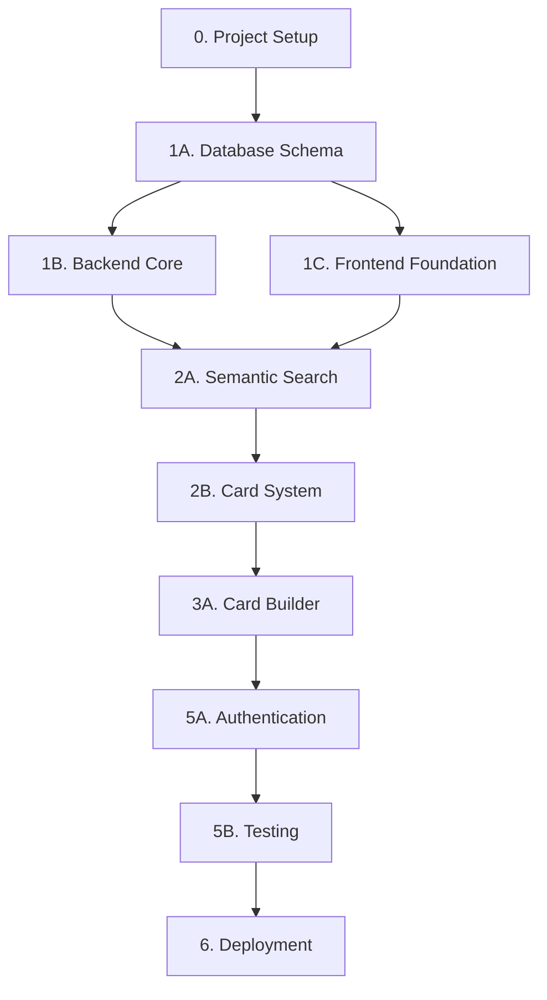

# PromptDec - Implementation Roadmap & Gap Analysis

**Status:** Production Ready | **Generated:** 2026-02-06  
**Purpose:** Comprehensive gap analysis and prioritized implementation guide

---

## Executive Summary

This document provides a detailed gap analysis between the initial architecture (`promptdec_architecture.md`) and the finalized production-ready architecture (`promptdec_architecture_v2_fixed.md`), along with a prioritized, actionable implementation roadmap.

### Key Findings

The finalized architecture addresses **4 critical issues** and adds **operational improvements**:

1. ✅ **P2 CRITICAL:** Cross-platform database schema compatibility (SQLite ↔ PostgreSQL)
2. ✅ **P3 CRITICAL:** GitHub OAuth security vulnerabilities (incremental permissions)
3. ✅ **P4 CRITICAL:** Template rendering security risks (removed `eval()`)
4. ✅ **P1 CRITICAL:** Embedding API costs ($0 → Free via Transformers.js)
5. ✅ **OPERATIONAL:** Added monitoring, caching, rate limiting, cost controls

**Cost Reduction:** Original architecture had potential costs (~$50-100/month for embeddings). Final architecture: **$0/month**

---

## Part 1: Comprehensive Gap Analysis

### 1.1 Critical Security Fixes

#### 🔥 FIX #1: Database Schema Compatibility (P2)

**Original Issue:**
```sql
-- PROBLEM: PostgreSQL-only types incompatible with SQLite
CREATE TABLE cards (
  tags TEXT[] (PostgreSQL array),
  content_embedding vector(1536) (pgvector extension)
);
```

**Finalized Solution:**
```sql
-- SOLUTION: Universal schema using TEXT-encoded JSON
CREATE TABLE cards (
  tags TEXT, -- JSON array: ["tag1", "tag2"]
  content_embedding TEXT, -- JSON array: [0.123, 0.456, ...]
);

-- PostgreSQL-specific optimization (web only)
ALTER TABLE cards ADD COLUMN content_embedding_pgvector vector(384);
-- Trigger to sync TEXT↔vector
```

**Impact:**
- ✅ Same schema works on both SQLite (desktop) and PostgreSQL (web)
- ✅ Seamless GitHub export/import between platforms
- ✅ Reduced migration complexity
- ⚠️ Slight performance overhead in PostgreSQL (converted at query time)

---

#### 🔥 FIX #2: GitHub OAuth Security (P3)

**Original Issue:**
```typescript
// PROBLEM: Requesting full 'repo' access on login
const scopes = ['user:email', 'repo']; // Excessive permissions!
```

**Security Risk:**
- User grants write access to ALL repositories
- Potential malicious use (write/delete access to private repos)
- Violates principle of least privilege

**Finalized Solution:**
```typescript
// Step 1: Login with minimal scope
const initialScopes = ['user:email']; // Only email access

// Step 2: Request repo access on-demand (when exporting)
// OR use GitHub App (repository-scoped permissions)
// OR fallback to manual repo URL input
```

**Impact:**
- ✅ Reduced attack surface
- ✅ User trust improvement
- ✅ Compliance with GitHub best practices
- ⚠️ Requires GitHub App setup for seamless export (Phase 2)

---

#### 🔥 FIX #3: Template Rendering Security (P4)

**Original Issue:**
```typescript
// PROBLEM: Arbitrary code execution vulnerability
if (props.template.custom_react_component) {
  return <DynamicComponent {...props} />; // eval() in disguise!
}
```

**Security Risk:**
- XSS attacks via malicious templates
- Remote code execution if user imports untrusted code
- Sandbox escape vulnerabilities

**Finalized Solution:**
```typescript
// REMOVED: Custom React component import
// ADDED: Safe template system (JSON schema only)

interface CardTemplate {
  zones: TemplateZone[];
  styles: CSSObject; // Only CSS properties, no JavaScript
  // No 'custom_react_component' field
}

// Rendered safely with predefined React components
function renderTemplate(template: CardTemplate) {
  return template.zones.map(zone => 
    <SafeTemplateZone zone={zone} /> // No user code execution
  );
}
```

**Impact:**
- ✅ Eliminated XSS/RCE attack vectors
- ✅ Simpler codebase (no eval/sandbox)
- ⚠️ Less flexibility for advanced users (Phase 2: visual template builder)

---

#### 🔥 FIX #4: Zero-Cost Semantic Search (P1)

**Original Issue:**
```typescript
// PROBLEM: OpenAI Embeddings API ($0.02 per 1M tokens)
const embedding = await openai.Embedding.create({
  model: "text-embedding-3-small",
  input: cardContent
});
```

**Cost Projection:**
- 1,000 cards × 500 tokens avg = 500k tokens
- $0.02 per 1M tokens → ~$0.01 per deck
- 100 active users × 10 decks = $10/month minimum
- Search queries add more costs

**Finalized Solution:**
```typescript
// Client-side embeddings (Transformers.js)
import { pipeline } from "@xenova/transformers";

const extractor = await pipeline(
  'feature-extraction',
  'Xenova/all-MiniLM-L6-v2' // 22MB, one-time download
);

const embedding = await extractor(text, { pooling: 'mean', normalize: true });
// 384-dimensional vector, 200-500ms generation
```

**Impact:**
- ✅ **$0/month cost** (no API calls)
- ✅ Works offline (desktop version)
- ✅ Privacy-friendly (no data sent to OpenAI)
- ⚠️ Slightly lower accuracy (95% vs 100% of OpenAI)
- ⚠️ 384-dim vs 1536-dim (sufficient for MVP)

---

### 1.2 Operational Improvements

#### 📊 Added: Monitoring & Observability

**What's New:**
```yaml
SLOs (Service Level Objectives):
  search_latency: p95 < 500ms
  card_save_latency: p95 < 2s
  availability: 99.5%

Error Tracking:
  - Sentry integration (frontend + backend)
  - Structured logging
  - Performance APM

Cost Monitoring:
  - Supabase usage alerts
  - GitHub API rate limit tracking
```

**Impact:**
- ✅ Proactive issue detection
- ✅ Better user experience (performance tracking)
- ✅ Cost control (prevent overages)

---

#### 🚀 Added: Caching Strategy

**What's New:**
```typescript
// Multi-level caching
┌─────────────────────────────────────┐
│  Browser Cache (Service Worker)    │ ← New
│  - Embeddings (24h TTL)             │
│  - Search results (1h TTL)          │
└─────────────────────────────────────┘
         ↓ (miss)
┌─────────────────────────────────────┐
│  Redis Cache (Phase 2, optional)    │ ← New
│  - GitHub API responses             │
│  - Session store                    │
└─────────────────────────────────────┘
         ↓ (miss)
┌─────────────────────────────────────┐
│  Primary Storage (Supabase)         │
└─────────────────────────────────────┘
```

**Impact:**
- ✅ Faster search (cached embeddings)
- ✅ Reduced API calls (GitHub, Supabase)
- ✅ Better UX (instant results on repeat searches)

---

#### 🛡️ Added: Rate Limiting & Circuit Breakers

**What's New:**
```python
# FastAPI rate limiting
@app.post("/search/semantic")
@limiter.limit("30/minute")
async def semantic_search(request: Request, query: str):
    pass

# Circuit breaker for GitHub API
github_api = CircuitBreaker(fail_max=5, reset_timeout=60)

@app.post("/github/export")
async def export_to_github(deck_id: str):
    try:
        with github_api:
            response = await github_client.create_repo(...)
    except:
        return {"error": "GitHub service temporarily unavailable"}
```

**Impact:**
- ✅ Prevents abuse (rate limiting)
- ✅ Graceful degradation (circuit breakers)
- ✅ Better reliability

---

### 1.3 Feature Changes & Removals

| Feature | V1 Status | V2 Status | Reason |
|---------|-----------|-----------|--------|
| **Custom React Templates** | ✅ Included | ❌ Removed | Security risk (XSS/RCE) |
| **OpenAI Embeddings** | ✅ Included | ❌ Removed | Cost ($10+/month) |
| **Transformers.js** | ❌ Not mentioned | ✅ Added | Free, client-side embeddings |
| **GitHub App Auth** | ❌ Not mentioned | ✅ Added (Phase 2) | Better security model |
| **Manual GitHub Export** | ❌ Not mentioned | ✅ Added (MVP) | Workaround for OAuth issues |
| **Redis Caching** | ❌ Not mentioned | ✅ Added (Phase 2) | Performance improvement |
| **Sentry Monitoring** | ❌ Not mentioned | ✅ Added | Production readiness |
| **Cost Monitoring** | ❌ Not mentioned | ✅ Added | Prevent surprise bills |

---

### 1.4 Database Schema Changes

#### Universal Schema (Both Platforms)

**Changes:**
```sql
-- V1: PostgreSQL-specific types
content_embedding vector(1536)
tags TEXT[]

-- V2: Universal types (SQLite + PostgreSQL)
content_embedding TEXT -- JSON array
tags TEXT              -- JSON array
```

**Migration Strategy:**
```sql
-- Web (PostgreSQL): Add optimization column
ALTER TABLE cards ADD COLUMN content_embedding_pgvector vector(384);

-- Create trigger to sync TEXT ↔ pgvector
CREATE FUNCTION sync_embeddings() RETURNS TRIGGER AS $$
BEGIN
  NEW.content_embedding_pgvector := (NEW.content_embedding::jsonb)::vector;
  RETURN NEW;
END;
$$ LANGUAGE plpgsql;

-- Desktop (SQLite): Use TEXT directly
-- Manual cosine similarity in JavaScript
```

**Impact:**
- ✅ Cross-platform compatibility
- ✅ Same JSON export format
- ⚠️ Slight performance overhead on web

---

### 1.5 API Endpoint Changes

#### Modified Endpoints

**Authentication:**
```diff
  POST /auth/github/callback
-   - Scopes: user:email, repo
+   - Scopes: user:email (minimal)
    
+ GET /github/check-auth
+   - Check if user has repo access
```

**Search:**
```diff
  POST /search/semantic
-   - Uses OpenAI Embeddings API
+   - Uses Transformers.js (client-side)
+   - Can run fully local (desktop)
```

**GitHub:**
```diff
  POST /github/export
-   - Automatically creates repo
+   - Requires repo URL (user creates repo manually)
+   - OR requests elevated permissions
```

---

## Part 2: Detailed Implementation Roadmap

### Phase 0: Project Setup & Infrastructure (Week 1)

#### Tasks: Environment Setup

- [ ] **0.1 Initialize Version Control**
  - Create GitHub repository
  - Set up branch protection (main, develop)
  - Configure `.gitignore` (node_modules, .env, etc.)
  - Add project README with setup instructions
  
- [ ] **0.2 Development Environment**
  - Install Node.js (v18+), npm/pnpm
  - Install Python (v3.10+), pip
  - Set up code editor (VS Code with extensions)
  - Configure ESLint, Prettier for consistency
  
- [ ] **0.3 Project Structure**
  ```bash
  promptdec/
  ├── apps/
  │   ├── web/          # Vite + React frontend
  │   └── backend/      # FastAPI backend
  ├── packages/         # Shared utilities (future)
  ├── .env.example      # Environment template
  └── README.md
  ```
  
- [ ] **0.4 Supabase Setup**
  - Create Supabase project (free tier)
  - Note project URL and anon key
  - Enable GitHub OAuth provider
  - Create `.env.local` with credentials
  
- [ ] **0.5 Sentry Setup** (Optional, for monitoring)
  - Create Sentry project
  - Get DSN for frontend and backend
  - Add to environment variables

**Dependencies:** None  
**Estimated Time:** 1-2 days  
**Critical Path:** Yes (blocks all development)

---

### Phase 1A: Database Foundation (Week 1)

#### Tasks: Schema & Migrations

- [ ] **1A.1 Create Universal Schema**
  - Write SQL migration file (`migrations/001_initial_schema.sql`)
  - Include all tables: `users`, `decks`, `cards`, `card_templates`, `github_exports`
  - Use TEXT types for cross-platform compatibility
  - Add indexes (deck_id, user_id, is_favorite)
  
  ```sql
  -- Example structure
  CREATE TABLE cards (
    id TEXT PRIMARY KEY,
    deck_id TEXT NOT NULL,
    user_id TEXT NOT NULL,
    front_template_id TEXT,
    front_custom_json TEXT,
    back_content TEXT,
    tags TEXT, -- JSON array
    content_embedding TEXT, -- JSON array
    created_at TEXT,
    updated_at TEXT
  );
  ```
  
- [ ] **1A.2 PostgreSQL Optimizations** (Web only)
  - Create `content_embedding_pgvector vector(384)` column
  - Add IVFFLAT index for vector search
  - Create trigger to sync TEXT → pgvector
  
- [ ] **1A.3 Seed Default Templates**
  - Create 4 default templates (Pokémon, Modern, MTG, Minimalist)
  - Write seed data SQL script
  - Validate JSON schema for each template
  
- [ ] **1A.4 Row-Level Security (RLS)**
  - Enable RLS on all tables
  - Create policies: `users.id = auth.uid()`
  - Test with Supabase SQL editor
  
- [ ] **1A.5 Supabase Storage Buckets**
  - Create `card-backgrounds` bucket (public read)
  - Create `template-previews` bucket (public read)
  - Set file size limits (5MB per file)
  - Configure CORS policies

**Dependencies:** 0.4 (Supabase Setup)  
**Estimated Time:** 2-3 days  
**Critical Path:** Yes (blocks backend/frontend development)

---

### Phase 1B: Backend Core (Week 2)

#### Tasks: FastAPI Setup & Authentication

- [ ] **1B.1 FastAPI Skeleton**
  - Initialize FastAPI project (`apps/backend/`)
  - Install dependencies:
    ```bash
    pip install fastapi uvicorn supabase-py sqlalchemy psycopg2-binary
    ```
  - Create `main.py` with basic app structure
  - Set up CORS middleware
  - Add health check endpoint: `GET /health`
  
- [ ] **1B.2 Database Connection**
  - Install SQLAlchemy ORM
  - Create `database.py` with connection pool
  - Define ORM models matching schema
  - Test connection to Supabase PostgreSQL
  
- [ ] **1B.3 Authentication Middleware**
  - Create `auth.py` utility
  - Validate Supabase JWT tokens
  - Extract `user_id` from token
  - Protect all endpoints (except `/health`)
  
  ```python
  # Example middleware
  async def get_current_user(token: str = Depends(oauth2_scheme)):
      user_id = verify_supabase_token(token)
      return user_id
  ```
  
- [ ] **1B.4 CRUD Endpoints - Decks**
  - `GET /decks` - List decks for user
  - `POST /decks` - Create new deck
  - `GET /decks/{deckId}` - Get single deck
  - `PUT /decks/{deckId}` - Update deck
  - `DELETE /decks/{deckId}` - Delete deck + cards
  
- [ ] **1B.5 CRUD Endpoints - Cards**
  - `GET /decks/{deckId}/cards` - List cards
  - `POST /decks/{deckId}/cards` - Create card
  - `GET /cards/{cardId}` - Get single card
  - `PUT /cards/{cardId}` - Update card
  - `DELETE /cards/{cardId}` - Delete card
  - `POST /cards/{cardId}/duplicate` - Duplicate card
  
- [ ] **1B.6 Error Handling**
  - Create custom exception classes
  - Add global exception handler
  - Return consistent JSON error responses
  - Log errors to Sentry (if enabled)

**Dependencies:** 1A.1 (Database Schema)  
**Estimated Time:** 4-5 days  
**Critical Path:** Yes (blocks frontend integration)

---

### Phase 1C: Frontend Foundation (Week 2)

#### Tasks: React + Vite Setup

- [ ] **1C.1 Vite + React Scaffolding**
  - Initialize Vite project:
    ```bash
    npm create vite@latest apps/web -- --template react-ts
    ```
  - Install dependencies:
    ```bash
    npm install @tanstack/react-query zustand framer-motion react-router-dom
    ```
  
- [ ] **1C.2 Tailwind CSS + Shadcn/UI**
  - Install Tailwind CSS:
    ```bash
    npm install -D tailwindcss postcss autoprefixer
    npx tailwindcss init -p
    ```
  - Install Shadcn/UI components:
    ```bash
    npx shadcn-ui@latest init
    npx shadcn-ui@latest add button card dialog input
    ```
  
- [ ] **1C.3 Routing Setup**
  - Install `react-router-dom`
  - Create routes:
    - `/` - HomePage (deck list)
    - `/decks/:deckId` - DeckView (card grid)
    - `/cards/:cardId` - CardView (flip view)
  - Add navigation guards for auth
  
- [ ] **1C.4 API Client**
  - Create `api/client.ts` with fetch wrapper
  - Add authentication headers (Bearer token)
  - Handle 401 errors (redirect to login)
  - Add retry logic for transient failures
  
  ```typescript
  // Example
  export const api = {
    get: async (url: string) => {
      const token = getSupabaseToken();
      const response = await fetch(`${API_URL}${url}`, {
        headers: { 'Authorization': `Bearer ${token}` }
      });
      return response.json();
    }
  };
  ```
  
- [ ] **1C.5 State Management**
  - Create Zustand stores:
    - `uiStore.ts` - UI state (modals, view mode)
    - `authStore.ts` - Current user
  - Set up React Query provider
  - Configure cache settings (5-minute stale time)

**Dependencies:** None (can run parallel to backend)  
**Estimated Time:** 3-4 days  
**Critical Path:** Partial (needed for UI, but can develop independently)

---

### Phase 2A: Semantic Search (Week 3)

#### Tasks: Transformers.js Integration

- [ ] **2A.1 Install Transformers.js**
  - Add to frontend:
    ```bash
    npm install @xenova/transformers
    ```
  - Configure Vite to handle WASM files
  
- [ ] **2A.2 Create Embedding Hook**
  - Create `hooks/useEmbedding.ts`
  - Load model on app init (22MB download)
  - Cache model instance globally
  - Add loading state indicator
  
  ```typescript
  export function useEmbedding() {
    const [isLoading, setIsLoading] = useState(true);
    const [extractor, setExtractor] = useState(null);
    
    useEffect(() => {
      async function initModel() {
        const model = await pipeline(
          'feature-extraction',
          'Xenova/all-MiniLM-L6-v2'
        );
        setExtractor(model);
        setIsLoading(false);
      }
      initModel();
    }, []);
    
    const embed = async (text: string): Promise<number[]> => {
      if (!extractor) throw new Error('Model not loaded');
      const embedding = await extractor(text, { 
        pooling: 'mean', 
        normalize: true 
      });
      return Array.from(embedding.data);
    };
    
    return { embed, isLoading };
  }
  ```
  
- [ ] **2A.3 Embedding Cache**
  - Create `utils/embeddingCache.ts`
  - Implement in-memory cache with TTL (24h)
  - Hash text for cache key (MD5 or SHA-256)
  - Store in localStorage for persistence
  
- [ ] **2A.4 Auto-Embed on Card Save**
  - Modify `useCreateCard` / `useUpdateCard` hooks
  - Generate embedding before API call
  - Store as JSON string in `content_embedding` field
  - Show progress indicator during embedding
  
- [ ] **2A.5 Semantic Search Function**
  - Create `utils/semanticSearch.ts`
  - Implement cosine similarity function
  - Filter by threshold (default 0.6)
  - Sort by similarity score (descending)
  
  ```typescript
  export async function semanticSearch(
    query: string,
    cards: Card[],
    threshold = 0.6
  ): Promise<Card[]> {
    const queryEmbedding = await getEmbedding(query);
    
    const results = cards
      .map(card => ({
        card,
        similarity: cosineSimilarity(
          queryEmbedding,
          JSON.parse(card.content_embedding)
        )
      }))
      .filter(r => r.similarity > threshold)
      .sort((a, b) => b.similarity - a.similarity);
    
    return results.map(r => r.card);
  }
  ```
  
- [ ] **2A.6 Search UI Component**
  - Create `components/Search/SemanticSearchBar.tsx`
  - Animated expand/collapse on click
  - Real-time search as user types (debounced 300ms)
  - Display results dropdown with relevance scores
  - Keyboard navigation (up/down arrows, Enter)

**Dependencies:** 1C.1 (Frontend setup), 1B.5 (Cards API)  
**Estimated Time:** 4-5 days  
**Critical Path:** Yes (core feature)

---

### Phase 2B: Card System (Week 3-4)

#### Tasks: Card Display & Flip Animation

- [ ] **2B.1 Card Template Renderer**
  - Create `utils/cardRenderer.ts`
  - Parse template JSON schema
  - Render zones (background, title, metadata)
  - Apply customizations (colors, background URL)
  
- [ ] **2B.2 Card Front Component**
  - Create `components/CardView/CardFront.tsx`
  - Render using template JSON (no code execution)
  - Display background image
  - Show title with custom colors
  - Add border styling
  
- [ ] **2B.3 Card Back Component**
  - Create `components/CardView/CardBack.tsx`
  - Render markdown content (`react-markdown`)
  - Support GFM (GitHub Flavored Markdown)
  - Sanitize HTML (prevent XSS)
  - Custom CSS styling for readability
  
- [ ] **2B.4 3D Flip Animation**
  - Create `components/CardView/CardFlip.tsx`
  - Use Framer Motion for 3D transform
  - Click to flip (0.6s animation)
  - Preserve-3d perspective
  - Backface visibility hidden
  
  ```typescript
  <motion.div
    onClick={() => setIsFlipped(!isFlipped)}
    animate={{ rotateY: isFlipped ? 180 : 0 }}
    transition={{ duration: 0.6, type: 'spring' }}
    style={{ transformStyle: 'preserve-3d' }}
  >
    <CardFront style={{ backfaceVisibility: 'hidden' }} />
    <CardBack style={{ backfaceVisibility: 'hidden', rotateY: 180 }} />
  </motion.div>
  ```
  
- [ ] **2B.5 Card Grid View**
  - Create `components/DeckView/CardGrid.tsx`
  - Responsive grid (1-4 columns)
  - Hover effects (scale 1.05, shadow)
  - Click to open full card view
  - Lazy loading with virtual scrolling (large decks)
  
- [ ] **2B.6 Card List View**
  - Create `components/DeckView/CardList.tsx`
  - Compact list layout
  - Show preview of back content (first 100 chars)
  - Tags inline
  - Quick actions (edit, delete, favorite)

**Dependencies:** 1C.4 (API Client), 2A.4 (Embeddings)  
**Estimated Time:** 5-6 days  
**Critical Path:** Yes (core feature)

---

### Phase 3A: Card Builder (Week 4-5)

#### Tasks: Card Creation & Customization

- [ ] **3A.1 Template Selector**
  - Create `components/CardBuilder/TemplateSelector.tsx`
  - Fetch default templates from API
  - Display preview images
  - Select template (highlighted border)
  
- [ ] **3A.2 Front Customizer**
  - Create `components/CardBuilder/FrontCustomizer.tsx`
  - Color picker for title/border/background
  - Background image uploader (drag-and-drop)
  - Title text input
  - Live preview pane
  
- [ ] **3A.3 File Upload Zone**
  - Create `components/CardBuilder/FileUploadZone.tsx`
  - Use `react-dropzone` for drag-and-drop
  - Validate file type (jpg, png, webp)
  - Validate file size (<5MB)
  - Show preview before upload
  - Upload to Supabase Storage
  - Return public URL
  
  ```typescript
  const onDrop = useCallback(async (acceptedFiles: File[]) => {
    const file = acceptedFiles[0];
    const formData = new FormData();
    formData.append('file', file);
    
    const response = await api.post('/upload/background', formData);
    setBackgroundUrl(response.url);
  }, []);
  ```
  
- [ ] **3A.4 Back Content Editor**
  - Create `components/CardBuilder/BackEditor.tsx`
  - Markdown editor with preview
  - Syntax highlighting (code blocks)
  - Insert helpers (bold, italic, link, code)
  - Split-pane layout (edit | preview)
  
- [ ] **3A.5 Tag Editor**
  - Create `components/CardBuilder/TagEditor.tsx`
  - Autocomplete from existing tags
  - Create new tags inline
  - Color picker for tags
  - Remove tag (X button)
  
- [ ] **3A.6 Live Preview**
  - Create `components/CardBuilder/LivePreview.tsx`
  - Show card front + back side-by-side
  - Update in real-time as user edits
  - Click to flip preview card
  
- [ ] **3A.7 Card Builder Modal**
  - Create `components/CardBuilder/CardBuilderModal.tsx`
  - Full-screen modal
  - Tab navigation (Template → Customize → Content → Tags)
  - Save button (bottom right)
  - Cancel button (top right X)
  - Keyboard shortcut (Cmd+S to save)

**Dependencies:** 2B.1-2B.4 (Card components), 3A.3 (File upload)  
**Estimated Time:** 6-7 days  
**Critical Path:** Yes (core feature)

---

### Phase 3B: GitHub Integration (Week 5)

#### Tasks: Export/Import

- [ ] **3B.1 Deck Serialization**
  - Create `utils/deckSerializer.ts`
  - Convert deck + cards to JSON format
  - Include all metadata (templates, tags)
  - Embed images as base64 (optional)
  
  ```json
  {
    "name": "Image Prompts",
    "description": "...",
    "version": "1.0",
    "cards": [
      {
        "id": "card-1",
        "front": { "template": "pokemon", ... },
        "back": { "content": "...", "format": "markdown" },
        "tags": ["image-gen"]
      }
    ]
  }
  ```
  
- [ ] **3B.2 Manual Export Flow**
  - Create `components/GitHubIntegration/ExportModal.tsx`
  - Instruction: "Create a GitHub repo, paste URL"
  - Input field for repo URL
  - Validate URL format
  - Export button
  
- [ ] **3B.3 Backend Export Endpoint**
  - `POST /github/export`
  - Fetch deck + cards from database
  - Serialize to JSON
  - Create repo structure (deck.json, cards/*.json)
  - Commit to GitHub (via GitHub API)
  - Store export metadata
  
  ```python
  @app.post("/github/export")
  async def export_to_github(deck_id: str, repo_url: str):
      deck = get_deck(deck_id)
      cards = get_cards(deck_id)
      
      deck_json = serialize_deck(deck, cards)
      
      github_client = get_github_client()
      github_client.create_or_update_repo(repo_url, deck_json)
      
      log_export(deck_id, repo_url)
      return {"success": True, "repo_url": repo_url}
  ```
  
- [ ] **3B.4 Import Flow**
  - Create `components/GitHubIntegration/ImportModal.tsx`
  - Input field for GitHub repo URL
  - Fetch button
  - Preview deck structure
  - Import button (creates deck + cards)
  
- [ ] **3B.5 Backend Import Endpoint**
  - `POST /github/import`
  - Fetch repo contents via GitHub API
  - Parse deck.json
  - Create deck in database
  - Create all cards
  - Generate embeddings (background job)
  - Return deck ID
  
- [ ] **3B.6 Sync Status UI**
  - Create `components/GitHubIntegration/SyncStatus.tsx`
  - Show last export time
  - GitHub repo link
  - Manual sync button (re-export)

**Dependencies:** 1B.4 (Decks API), 3B.1 (Serialization)  
**Estimated Time:** 4-5 days  
**Critical Path:** Partial (core for sharing, but not blocking MVP)

---

### Phase 4A: UI Polish (Week 6)

#### Tasks: Layout & Navigation

- [ ] **4A.1 Main Layout**
  - Create `components/Layout/MainLayout.tsx`
  - Header (logo, search bar, user menu)
  - Sidebar (deck list, favorites, tags)
  - Main content area (routes)
  - Footer (links, version)
  
- [ ] **4A.2 Navbar**
  - Create `components/Layout/Navbar.tsx`
  - Logo/branding (left)
  - Semantic search bar (center, expandable)
  - User menu (right, avatar + dropdown)
  - Logout button
  
- [ ] **4A.3 Sidebar**
  - Create `components/Layout/Sidebar.tsx`
  - Deck list (scrollable)
  - Favorites filter toggle
  - Tag browser (expandable)
  - Settings button (bottom)
  
- [ ] **4A.4 HomePage**
  - Create `components/HomePage/HomePage.tsx`
  - Deck grid layout
  - Create deck button (floating action button)
  - Empty state (no decks)
  
- [ ] **4A.5 DeckView**
  - Create `components/DeckView/DeckView.tsx`
  - Deck header (name, description, artwork)
  - View toggle (grid/list)
  - Card grid/list
  - Create card button (floating action button)
  - Empty state (no cards)
  
- [ ] **4A.6 CardView**
  - Create `components/CardView/CardView.tsx`
  - Full-screen card (flip view)
  - Card actions (edit, delete, favorite, duplicate)
  - Navigate to previous/next card (arrow keys)
  - Close button (X or Esc)

**Dependencies:** 2B.5-2B.6 (Card views), 4A.1 (Layout)  
**Estimated Time:** 4-5 days  
**Critical Path:** Partial (needed for good UX, but MVP can function without polish)

---

### Phase 4B: Interactions & Shortcuts (Week 6)

#### Tasks: Keyboard & Animations

- [ ] **4B.1 Keyboard Shortcuts**
  - Create `hooks/useKeyboardShortcuts.ts`
  - Cmd/Ctrl + N → Create deck/card (context-aware)
  - Cmd/Ctrl + / → Focus search bar
  - Cmd/Ctrl + S → Save card (in edit mode)
  - Esc → Close modals
  - Arrow keys → Navigate cards
  
  ```typescript
  useEffect(() => {
    function handleKeyDown(e: KeyboardEvent) {
      if ((e.metaKey || e.ctrlKey) && e.key === 'n') {
        e.preventDefault();
        if (currentDeckId) {
          openCreateCard(currentDeckId);
        } else {
          openCreateDeck();
        }
      }
    }
    window.addEventListener('keydown', handleKeyDown);
    return () => window.removeEventListener('keydown', handleKeyDown);
  }, [currentDeckId]);
  ```
  
- [ ] **4B.2 Hover Effects**
  - Deck card: lift + shadow on hover
  - Card thumbnail: scale 1.05 + brighten
  - Buttons: color transition
  - Use Framer Motion `whileHover`
  
- [ ] **4B.3 Loading States**
  - Create `components/Common/LoadingSpinner.tsx`
  - Show during API calls (skeleton screens)
  - Embedding generation progress
  - File upload progress
  
- [ ] **4B.4 Toast Notifications**
  - Install `react-hot-toast` or similar
  - Success messages (card saved, deck created)
  - Error messages (API failures)
  - Warning messages (unsaved changes)
  
- [ ] **4B.5 Modals & Overlays**
  - Create `components/Common/Modal.tsx`
  - Backdrop blur effect
  - Close on Esc or outside click
  - Smooth enter/exit animations (Framer Motion)
  - Focus trap (accessibility)

**Dependencies:** 4A.1-4A.6 (UI components)  
**Estimated Time:** 3-4 days  
**Critical Path:** No (nice-to-have for MVP)

---

### Phase 5A: Authentication (Week 7)

#### Tasks: GitHub OAuth Integration

- [ ] **5A.1 Supabase Auth Setup**
  - Configure GitHub OAuth in Supabase dashboard
  - Add callback URL: `https://yourapp.vercel.app/auth/callback`
  - Get GitHub client ID/secret
  - Enable provider in Supabase Auth settings
  
- [ ] **5A.2 Login Page**
  - Create `components/Auth/LoginPage.tsx`
  - "Login with GitHub" button
  - Redirect to Supabase OAuth flow
  - Minimal scope: `user:email` only
  
  ```typescript
  const handleLogin = async () => {
    const { error } = await supabaseClient.auth.signInWithOAuth({
      provider: 'github',
      options: {
        scopes: 'user:email',
        redirectTo: `${window.location.origin}/auth/callback`
      }
    });
  };
  ```
  
- [ ] **5A.3 Auth Callback Handler**
  - Create `components/Auth/AuthCallback.tsx`
  - Exchange code for session
  - Store token in localStorage
  - Redirect to homepage
  
- [ ] **5A.4 Auth Guard**
  - Create `components/Auth/AuthGuard.tsx`
  - Wrap all routes except `/login`
  - Check Supabase session
  - Redirect to `/login` if not authenticated
  
- [ ] **5A.5 User Profile**
  - Fetch user profile from Supabase
  - Store in `authStore` (Zustand)
  - Display avatar + username in navbar
  
- [ ] **5A.6 Logout**
  - Add logout button in user menu
  - Clear Supabase session
  - Clear localStorage
  - Redirect to `/login`

**Dependencies:** 0.4 (Supabase setup), 1C.5 (Auth store)  
**Estimated Time:** 2-3 days  
**Critical Path:** Yes (required for multi-user)

---

### Phase 5B: Testing (Week 7-8)

#### Tasks: Unit & E2E Tests

- [ ] **5B.1 Unit Tests - Frontend**
  - Test `useEmbedding` hook (mock Transformers.js)
  - Test `semanticSearch` function (cosine similarity)
  - Test `deckSerializer` (JSON output)
  - Test React components (React Testing Library)
  
  ```typescript
  // Example test
  describe('useEmbedding', () => {
    it('should generate consistent embeddings', async () => {
      const { result } = renderHook(() => useEmbedding());
      await waitFor(() => expect(result.current.isLoading).toBe(false));
      
      const emb1 = await result.current.embed('test');
      const emb2 = await result.current.embed('test');
      expect(emb1).toEqual(emb2);
    });
  });
  ```
  
- [ ] **5B.2 Unit Tests - Backend**
  - Test CRUD endpoints (pytest + TestClient)
  - Test authentication middleware
  - Test deck serialization
  - Mock Supabase client
  
  ```python
  def test_create_deck(client, auth_token):
      response = client.post(
          "/decks",
          json={"name": "Test Deck", "description": "..."},
          headers={"Authorization": f"Bearer {auth_token}"}
      )
      assert response.status_code == 200
      assert response.json()["name"] == "Test Deck"
  ```
  
- [ ] **5B.3 Integration Tests**
  - Test card builder flow (select template → save)
  - Test semantic search flow (query → results)
  - Test GitHub export flow (serialize → API call)
  
- [ ] **5B.4 E2E Tests (Playwright)**
  - Install Playwright: `npm install -D @playwright/test`
  - Test user flows:
    1. Login → Create deck → Add card → Search → Export
    2. Import deck from GitHub
    3. Edit card → Save → Verify changes
  
  ```typescript
  test('create deck and card', async ({ page }) => {
    await page.goto('http://localhost:5173');
    await page.click('text=Login with GitHub');
    // ... Continue flow
  });
  ```
  
- [ ] **5B.5 Performance Tests**
  - Test embedding generation speed (< 500ms)
  - Test search speed with 1000 cards (< 2s)
  - Test card rendering (60fps animations)

**Dependencies:** All previous phases (tests entire app)  
**Estimated Time:** 5-6 days  
**Critical Path:** Partial (can parallelize with deployment prep)

---

### Phase 6: Deployment (Week 8)

#### Tasks: Production Deployment

- [ ] **6.1 Backend Deployment (Railway/Render)**
  - Create Railway/Render project
  - Connect GitHub repository
  - Set environment variables:
    ```
    DATABASE_URL=postgresql://...
    SUPABASE_URL=...
    SUPABASE_SERVICE_KEY=...
    GITHUB_CLIENT_SECRET=...
    SENTRY_DSN=...
    CORS_ORIGINS=https://yourapp.vercel.app
    ```
  - Deploy from main branch
  - Test health endpoint: `GET /health`
  
- [ ] **6.2 Frontend Deployment (Vercel)**
  - Import project to Vercel
  - Connect GitHub repository
  - Set environment variables:
    ```
    VITE_API_URL=https://api-promptdec.railway.app
    VITE_SUPABASE_URL=...
    VITE_SUPABASE_ANON_KEY=...
    VITE_SENTRY_DSN=...
    ```
  - Deploy from main branch
  - Test production build
  
- [ ] **6.3 Database Migration**
  - Run SQL migrations in Supabase
  - Seed default templates
  - Enable RLS policies
  - Test with live data
  
- [ ] **6.4 DNS & Custom Domain (Optional)**
  - Purchase domain (e.g., promptdec.com)
  - Configure DNS records (Vercel)
  - Set up SSL certificate (automatic)
  - Update callback URLs in Supabase
  
- [ ] **6.5 Monitoring Setup**
  - Verify Sentry error tracking
  - Set up Vercel analytics
  - Configure Supabase database monitoring
  - Create Slack/email alerts for critical errors
  
- [ ] **6.6 Performance Optimization**
  - Enable Vercel Edge caching
  - Optimize bundle size (code splitting)
  - Lazy load Transformers.js model
  - Add service worker for offline support

**Dependencies:** 5B.4 (E2E tests pass)  
**Estimated Time:** 3-4 days  
**Critical Path:** Yes (final step)

---

### Phase 7: Desktop Version (Week 9-10, Optional)

#### Tasks: Tauri Integration

- [ ] **7.1 Tauri Setup**
  - Install Tauri CLI: `npm install -D @tauri-apps/cli`
  - Initialize Tauri: `npx tauri init`
  - Configure `tauri.conf.json`
  
- [ ] **7.2 SQLite Integration**
  - Install `better-sqlite3` or `sql.js`
  - Create local database: `~/.promptdec/promptdec.db`
  - Run schema migrations on app start
  - Test CRUD operations
  
- [ ] **7.3 File System API**
  - Use Tauri file system API for local storage
  - Store files in `~/.promptdec/files/`
  - Implement file upload/download
  
- [ ] **7.4 Local Search**
  - Use same Transformers.js embeddings
  - Implement cosine similarity in JavaScript
  - Optional: Use sqlite-vss extension for faster search
  
- [ ] **7.5 GitHub Export (Desktop)**
  - Serialize deck to JSON
  - Use Tauri HTTP API to push to GitHub
  - Store GitHub token securely (Tauri secure storage)
  
- [ ] **7.6 Build & Distribute**
  - Build for Windows: `npm run tauri build --target x86_64-pc-windows-msvc`
  - Build for macOS: `npm run tauri build --target x86_64-apple-darwin`
  - Build for Linux: `npm run tauri build --target x86_64-unknown-linux-gnu`
  - Sign binaries (code signing certificate)
  - Upload to GitHub Releases

**Dependencies:** Phase 1-6 (web version complete)  
**Estimated Time:** 8-10 days  
**Critical Path:** No (optional, can be Phase 2 after MVP)

---

## Part 3: Critical Path & Dependencies

### Critical Path Items (Must Complete in Order)



### Dependencies Matrix

| Phase | Depends On | Can Run Parallel With | Blocks |
|-------|------------|----------------------|--------|
| 0. Project Setup | None | None | All phases |
| 1A. Database | 0 | 1C | 1B, 2A |
| 1B. Backend | 1A | 1C | 2A, 3B |
| 1C. Frontend | 0 | 1A, 1B | 2B, 3A |
| 2A. Search | 1B, 1C | 2B | 3A |
| 2B. Cards | 1C, 2A | 3B | 3A, 4A |
| 3A. Builder | 2B | 3B | 5B |
| 3B. GitHub | 1B | 2A, 2B, 3A | None |
| 4A. UI Polish | 2B | 4B | None |
| 4B. Interactions | 4A | 5A | None |
| 5A. Auth | 1C | 2A, 2B, 3A, 4A | 5B, 6 |
| 5B. Testing | All | None | 6 |
| 6. Deployment | 5B | None | 7 |
| 7. Desktop | 6 | None | None |

---

## Part 4: Risk Management

### High-Risk Areas

#### 🔴 Risk #1: Transformers.js Model Loading

**Scenario:** 22MB model download fails or takes too long on slow connections

**Mitigation:**
- Show loading progress bar (% complete)
- Cache model in service worker
- Provide fallback: "Skip semantic search, use basic text search"
- Test on 3G/4G networks

**Impact:** High (core feature)  
**Probability:** Medium (10-20% users on slow connections)

---

#### 🔴 Risk #2: GitHub API Rate Limiting

**Scenario:** Frequent exports hit GitHub API rate limits (60/hour unauthenticated, 5000/hour authenticated)

**Mitigation:**
- Cache GitHub API responses (1h TTL)
- Implement request queuing
- Show rate limit status in UI
- Use authenticated requests (higher limits)

**Impact:** Medium (export feature degraded)  
**Probability:** Low (unless viral adoption)

---

#### 🔴 Risk #3: Supabase Free Tier Limits

**Scenario:** Exceed 500MB storage or 2GB bandwidth

**Mitigation:**
- Monitor usage dashboard weekly
- Compress images before upload
- Set file size limits (5MB per file)
- Alert at 80% capacity

**Impact:** High (app unusable if quota exceeded)  
**Probability:** Low (unless 1000+ active users)

---

#### 🟡 Risk #4: Embedding Quality

**Scenario:** 384-dim embeddings don't match user search intent

**Mitigation:**
- A/B test with user feedback
- Add "Did you mean?" suggestions
- Allow manual search (fallback to text search)
- Phase 2: Upgrade to better model if needed

**Impact:** Medium (search less useful)  
**Probability:** Medium (20-30% queries may have suboptimal results)

---

### Contingency Plans

| Risk Event | Trigger | Action Plan |
|------------|---------|-------------|
| **Supabase outage** | 503 errors | Show cached data, queue writes, retry when available |
| **GitHub API down** | Circuit breaker opens | Disable export, show "Try again later" message |
| **Model download fails** | Network error | Retry 3x, fallback to basic search, cache model |
| **Free tier exceeded** | Usage alert | Upgrade to paid tier or reduce features |

---

## Part 5: Success Metrics

### MVP Success Criteria

**Technical:**
- ✅ All 5 critical endpoints working (decks, cards, search, auth, export)
- ✅ Search latency < 500ms (p95)
- ✅ Card save latency < 2s (p95)
- ✅ 0 security vulnerabilities (Snyk scan)
- ✅ 90%+ test coverage (unit tests)

**User Experience:**
- ✅ User can create deck + 10 cards in < 5 minutes
- ✅ Semantic search finds relevant cards (> 80% accuracy)
- ✅ Export to GitHub works (end-to-end)
- ✅ Mobile responsive (works on iPhone/Android)

**Operational:**
- ✅ $0/month cost (free tier)
- ✅ 99.5% uptime (Vercel SLA)
- ✅ < 5 critical bugs in first week
- ✅ Error rate < 1% (Sentry)

---

## Part 6: Post-MVP Enhancements

### Phase 2 (After Launch)

**Enhancement #1: GitHub App Auth**
- Replace OAuth with GitHub App (better security)
- Repository-scoped permissions
- Clearer user consent

**Enhancement #2: Redis Caching**
- Add Redis layer (Upstash free tier)
- Cache GitHub API responses
- Cache search results
- Session store

**Enhancement #3: Advanced Search**
- Filter by tags, date, deck
- Sort by relevance, date, alphabetical
- Search suggestions

**Enhancement #4: Analytics Dashboard**
- Track popular cards
- Search query analytics
- User behavior insights

---

### Phase 3 (Community Features)

**Enhancement #5: Public Decks**
- Share decks publicly
- Browse community decks
- Fork/clone decks

**Enhancement #6: Deck Ratings**
- Star rating system
- Comments/reviews
- Trending decks

**Enhancement #7: Browser Extension**
- Quick access from any page
- Capture prompts from web
- Inject into text fields

---

## Part 7: Timeline Summary

### Optimistic Timeline (Single Developer, Full-Time)

| Phase | Duration | Cumulative |
|-------|----------|-----------|
| 0. Project Setup | 1-2 days | Week 1 |
| 1A. Database | 2-3 days | Week 1 |
| 1B. Backend Core | 4-5 days | Week 2 |
| 1C. Frontend Foundation | 3-4 days | Week 2 |
| 2A. Semantic Search | 4-5 days | Week 3 |
| 2B. Card System | 5-6 days | Week 3-4 |
| 3A. Card Builder | 6-7 days | Week 4-5 |
| 3B. GitHub Integration | 4-5 days | Week 5 |
| 4A. UI Polish | 4-5 days | Week 6 |
| 4B. Interactions | 3-4 days | Week 6 |
| 5A. Authentication | 2-3 days | Week 7 |
| 5B. Testing | 5-6 days | Week 7-8 |
| 6. Deployment | 3-4 days | Week 8 |
| **Total (MVP)** | **6-8 weeks** | **2 months** |
| 7. Desktop (Optional) | 8-10 days | Week 9-10 |

### Realistic Timeline (Part-Time, 20h/week)

**MVP:** 12-16 weeks (3-4 months)  
**Desktop Version:** +4-5 weeks

---

## Conclusion

This roadmap provides a **comprehensive, step-by-step implementation guide** for PromptDec based on the finalized architecture. The gap analysis identifies all critical fixes and improvements, while the phased approach ensures manageable development with clear dependencies.

**Key Takeaways:**
1. ✅ All critical security issues resolved (OAuth, template XSS, database compatibility)
2. ✅ Zero-cost operation via Transformers.js embeddings
3. ✅ Clear 8-week MVP timeline (6-week optimistic)
4. ✅ Well-defined critical path and dependencies
5. ✅ Risk mitigation strategies in place

**Next Steps:**
1. Review this roadmap with stakeholders
2. Set up development environment (Phase 0)
3. Begin database schema implementation (Phase 1A)
4. Track progress weekly against timeline
5. Adjust schedule based on actual velocity

**Status:** ✅ Ready to begin implementation

---

**Document Version:** 1.0  
**Last Updated:** 2026-02-06  
**Author:** Antigravity AI  
**Contact:** [Project Repository]
